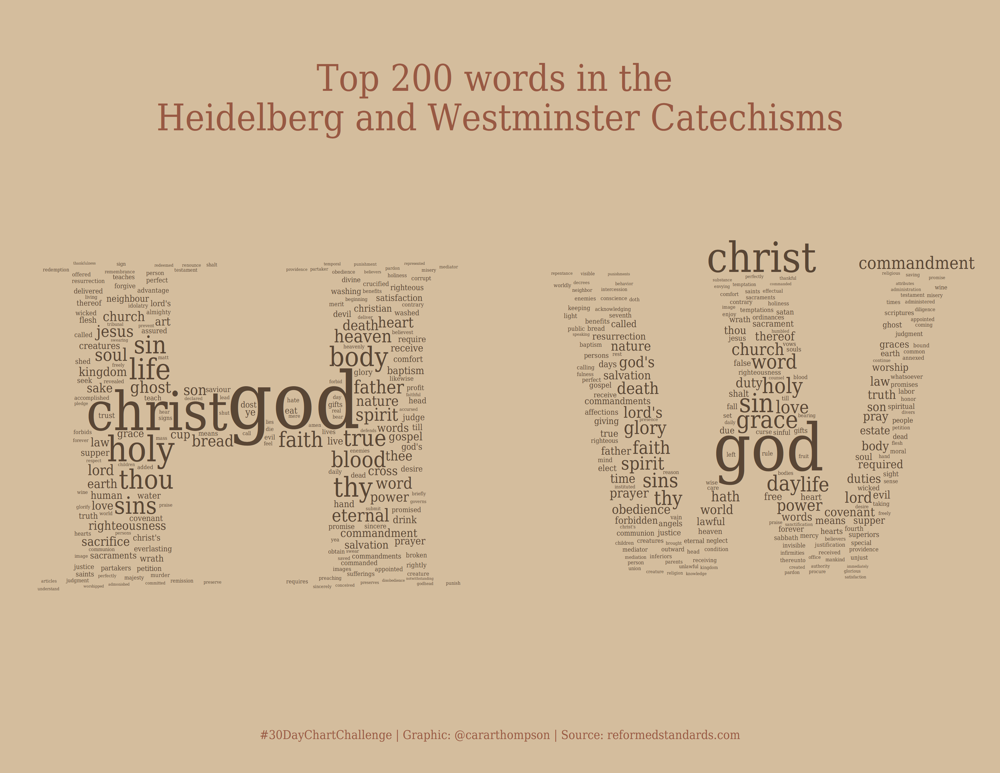
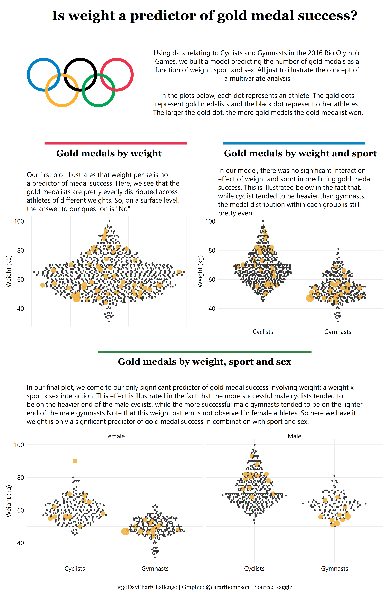

My \#30DayChartChallenge contributions - April 2021
================

Welcome to my \#30DayChartChallenge. Clicking on a plot will take you to
the code I wrote to build it. Happy browsing, and if you like what you
see, [get in touch](https://twitter.com/cararthompson)!

## What is the April 2021 \#30DayChartChallenge?

</a>

This challenge is organised by [Dominic
Royé](https://twitter.com/dr_xeo) and [Cédric
Scherer](https://twitter.com/CedScherer). Participants source and tidy
their own data before creating a chart. The categories in the challenge
are inspired by [Jon Schwabish](https://twitter.com/jschwabish)’s [The
Graphic Continuum](https://policyviz.com/2014/09/09/graphic-continuum/).
Any tools are allowed, but I have used R to create all of the charts
below.

[Find out more](https://twitter.com/30DayChartChall), [see what others
are
doing](https://twitter.com/hashtag/30DayChartChallenge?src=hashtag_click),
and join in - the more the merrier!

## Comparisons

### Day 1 - Part-to-whole

### Day 2 - Pictogram

### Day 3 - Historical

### Day 4 - Magical

### Day 5 - Slope

### Day 6 - Experimental

## Distributions

### Day 7 - Physical

### Day 8 - Animals

### Day 9 - Statistics

### Day 10 - Abstract

### Day 11 - Circular

### Day 12 - Strips

## Relationships

### Day 13 - Correlation

### Day 14 - Space

### Day 15 - Multivariate

### Day 16 - Trees

### Day 17 - Pop culture

### Day 18 - Connections

[Interactive
plot](https://silentlines.co.uk/portfolio-items/abide-psalms.html)

## Timeseries

### Day 19 - Global change

### Day 20 - Upwards

### Day 21 - Downwards

### Day 22 - Animation

<!-- ### Day 23 - Tiles -->
<!-- war and peace in Judges -->
<!-- ### Day 24 - Monochrome -->
<!-- ## Uncertainties -->
<!-- ### Day 25 - Demographic -->
<!-- Babies born on due date -->
<!-- ### Day 26 - Trends -->
<!-- ### Day 27 - Educational -->
<!-- SEM -->
<!-- ### Day 28 - Future -->
<!-- ### Day 29 - Deviations -->
<!-- ### Day 30 - 3D -->
